# OfficeManager
Project ini adalah sebuah website yang melibatkan FrontEnd dan BackEnd untuk melihat dan mengorganisir karyawan (employee) dalam sebuah organisasi

# Requirements
Code Editor (terutama VSCode)

npm (Node Package Manager)

React.js framework

node.js runtime environment

PostGreSQL database

NeonTech Database untuks support serverless database menggunakan PostGresql. Untuk detail database yang digunakan bisa dilihat pada .env pada root folder BackEnd.

# How to run
- Di root folder FrontEnd, buka terminal dan jalankan `npm run dev` untuk launch development website dalam localhost
- Di root folder BackEnd, buka terminal dan jalankan `node index.js` atau bisa juga `npm run start` untuk menyambungkan project dari FrontEnd ke BackEnd pada PostGresql yang nantinya juga akan tersambung ke NeonTech database.
- Enjoy

# Key Features
## Login/Register
#### Halaman login:

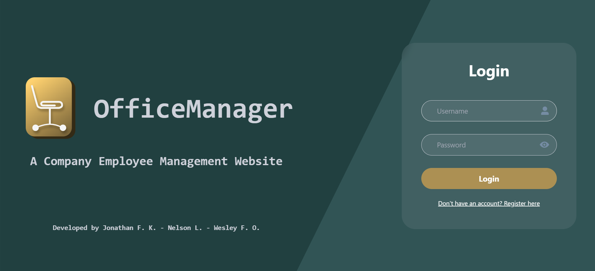&nbsp;&nbsp;&nbsp;&nbsp;&nbsp;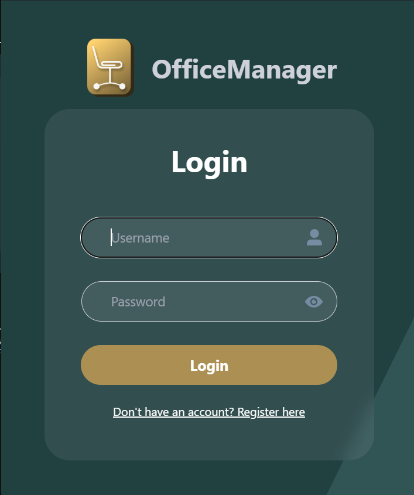 
Halaman ini akan langsung muncul ketika kita meluncurkan website untuk pertama kali. User harus melakukan **login** akun terlebih dahulu sebelum bisa melakukan apapun dalam website OfficeManager. Jika melakukan login, akan disambungkan ke database dan  memeriksa apakah username dan password terdapat di dalam database. Jika tidak ada username ataupun password yang cocok, akan muncul peringatan. User juga dapat melakukan **register** dan akan menambah username dan password yang diinput ke database.

Contoh username: tgtg

Contoh password: 123

#### Halaman Register:

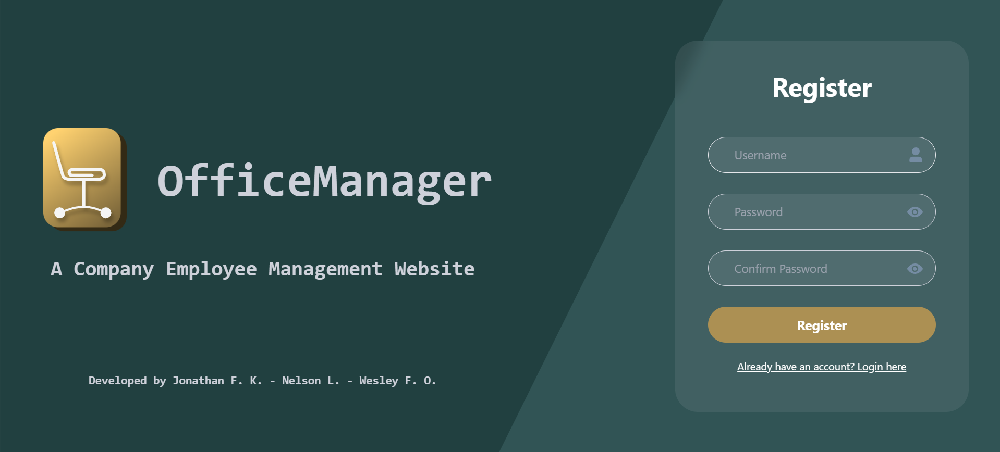&nbsp;&nbsp;&nbsp;&nbsp;&nbsp;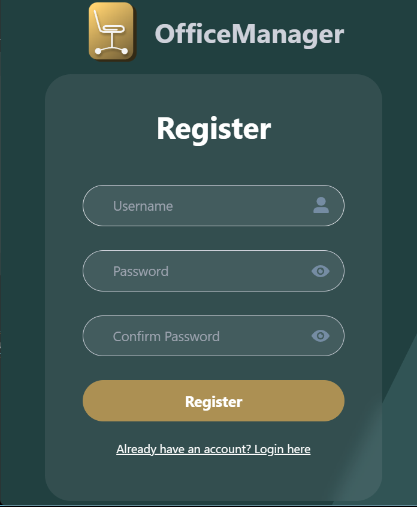 

## Home Page
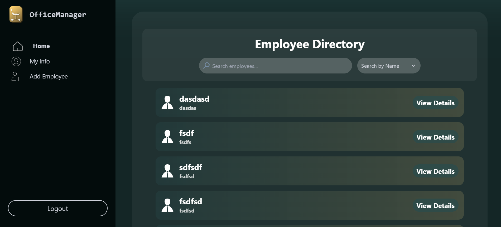&nbsp;&nbsp;&nbsp;&nbsp;&nbsp;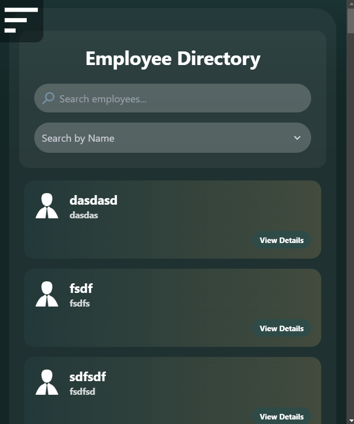 
Jika user berhasil login, akan langsung di-redirect ke Home Page. Halaman ini akan menyediakan daftar karyawan yang terdaftar dalam database dengan melakukan fetching database. User dapat menekan tombol *View Details* untuk melihat detail dari masing-masing karyawan.

## Employee Details
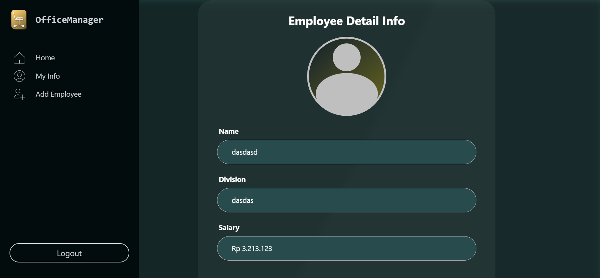&nbsp;&nbsp;&nbsp;&nbsp;&nbsp;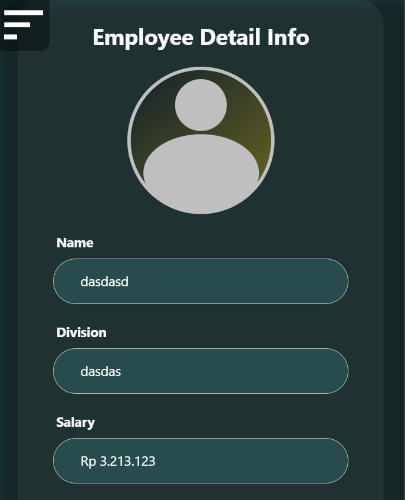 
Halaman ini dapat dilihat dengan menekan tombol *View Details* pada Home Page. Pada halaman ini, terdapat detail dari masing-masing karyawan, yaitu:
- Nama
- Divisi
- Salary (Gaji)

Jikalau terdapat nama yang sama, halaman ini akan selalu menampilkan detail kepada orang yang bersangkutan karena detail karyawan diambil berdasarkan urutan ID mereka dalam database.

## My Info
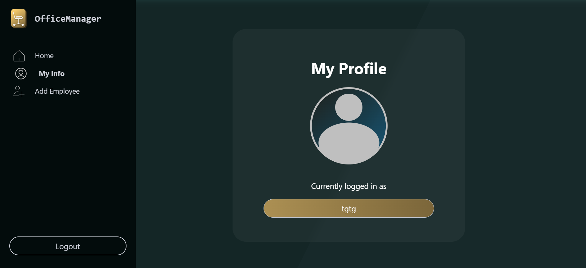&nbsp;&nbsp;&nbsp;&nbsp;&nbsp;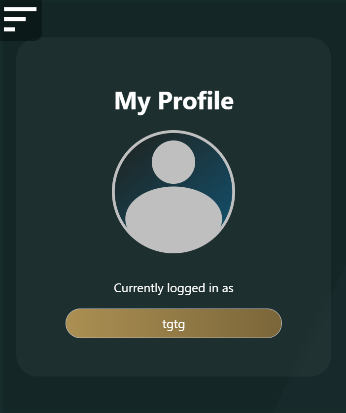 
Menampilkan informasi tentang user (manager) yaitu nama akun yang telah melakukan login.

## Add Employee
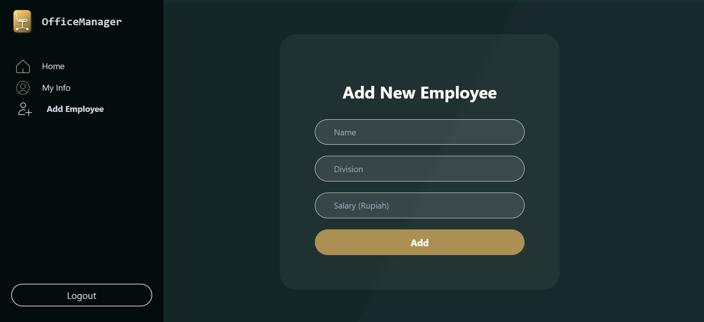&nbsp;&nbsp;&nbsp;&nbsp;&nbsp;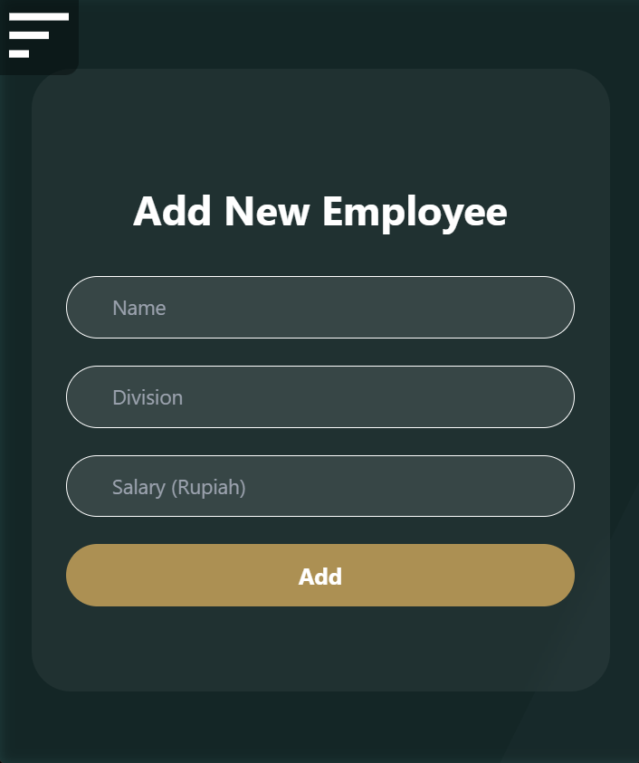 
User (manager) juga dapat menambahkan employee dalam database dengan cara memasukkan nama, divisi, dan gaji karyawan tersebut. Karyawan hanya dapat ditambahkan setelah semua input terisi, jadi jangan dibiarkan kosong.

# Other Features
## Page Resizing
Ukuran semua page dapat disesuaikan berdasarkan ukuran window yang digunakan. Terdapat dua versi dari masing-masing page, yaitu full screen dan small screen. Ini telah ditunjukkan pada bagian di atas. Gambar atas adalah jika window full screen sedangkan gambar bawah adalah window small.

## Dashboard
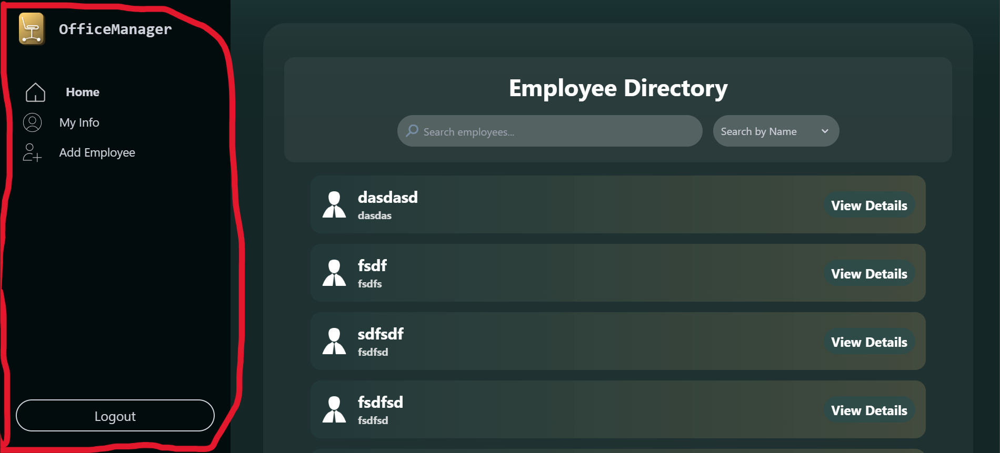&nbsp;&nbsp;&nbsp;&nbsp;&nbsp;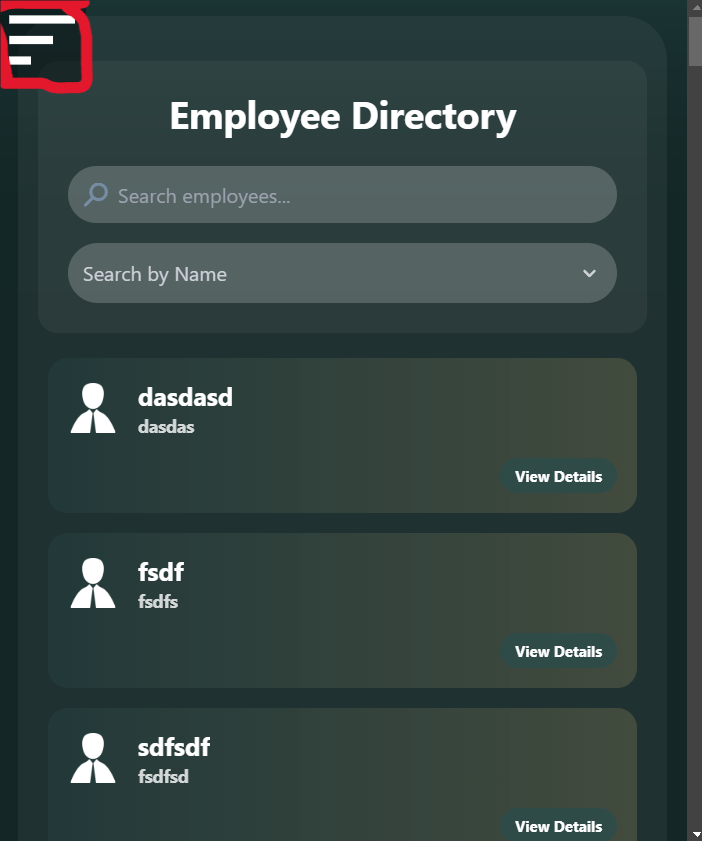 
Terdapat dashboard sebagai component dalam project ini. Dashboard ditunjukkan pada div berwarna hitam pada bagian kiri semua page. Ataupun dapat berbentuk burger icon yang dapat di-toggle untuk mengeluarkan menu dashboard jika windownya berukuran small.

Pada window small, sebelum toggle dashboard: 

Setelah toggle dashboard:  
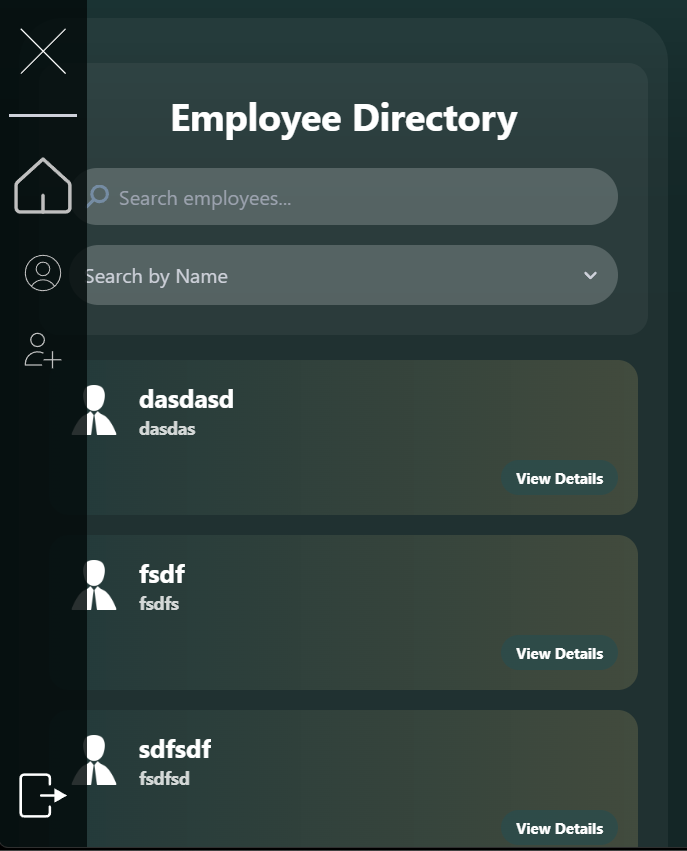

## Error Page Navigation
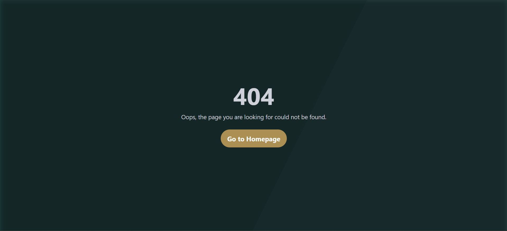 
Fitur tambahan, jika koneksi dengan database terputus tapi telah melakukan login, akan muncul error 404 yang menunjukkan navigasi ke Home Page error karena tidak dapat menampilkan daftar karyawan.

# Credits
Made by Jonathan Frederick Kosasih, Nelson Laurensius, Wesley Frederick Oh 

Computer Engineering 2023

Team 22 Technoskill 1.0
